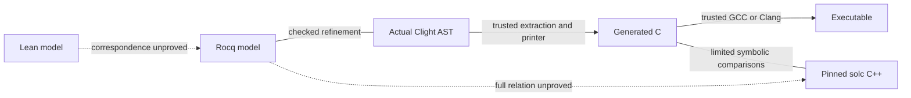

<!-- SPDX-License-Identifier: GPL-3.0-or-later -->
# Permute trust boundary

The main claim under development is the C ↔ Lean workflow. There are three
distinct review groups. A checked proof can establish the
wrong requirement if its statement is wrong. A correct Clight theorem also
does not establish a theorem about printed C or solc C++ without those links.

## 1. Definitions and claims that require human review

| Part | Files | Required review |
| --- | --- | --- |
| Public statements | [`PermuteCorrect.v`](../../spikes/clight-permute/PermuteCorrect.v) | The domain and conclusions express the required claim. The theorem is Clight-to-model refinement. |
| Lean source model | [`Defs.lean`](../../Shuffler/Permute/Defs.lean), [`Theorems.lean`](../../Shuffler/Permute/Theorems.lean) | The intended source specification and its proofs. No checked relation to the duplicate-aware Rocq model is supplied yet. |
| Call specification | [`PermuteSpec.v`](../../spikes/clight-permute/PermuteSpec.v) | Input memory, the actual function called, and the result-to-memory relation. |
| Model specification | [`ModelSpec.v`](../../spikes/clight-permute/ModelSpec.v) | Success, partial failure, exact blocked fields, trace legality, and the value-based depth condition. |
| Core definitions | [`SolcModel.v`](../../spikes/clight-permute/SolcModel.v), [`Permute.v`](../../spikes/clight-permute/Permute.v) | These are the intended mathematical algorithm and the actual Clight AST. Their agreement is checked, but their relation to the user requirement needs review. |
| Representation definitions | `ClightMemory.array_at`, `writable_array`; `ModelArrays.words`; `ClightScalar.uint`; `ClightCall.call_arguments` | Array contents, capacities, word bounds, and ABI argument order mean what the contract claims. |
| Shared model definitions | `Legacy.Permute` and `Legacy.Proofs.SwapTrace` | Selection, permutation composition, depth, and legal trace steps have the intended meaning. |
| Upstream semantics | Audited LGPL CompCert sources, Rocq/MathComp definitions | The formal language, arithmetic, and memory semantics describe the intended platform. |

The specification files contain definitions without proof tactics. Some
lower-level representation definitions still share files with their lemmas;
the table identifies the definitions that affect the public statement.

## 2. Proof scripts that need no independent correctness assumption

Rocq checks the proof terms produced by `ModelProofs.v`, `ClightCorrect.v`,
`Reachability.v`, `ClightReachability.v`, and the other proof modules.
`PermuteCorrect.v` supplies a short public interface to those proofs.
Proof tactics and intermediate lemmas can be wrong; the kernel must reject
a term that does not prove its statement under the permitted assumptions.

This claim depends on the Rocq kernel and correct invocation of its checks.
`coqchk` alone is insufficient: it accepts declared axioms and can retain
unsafe guard or positivity settings. The current runner also checks:

- The assumptions of every enumerated theorem against the existing six-name
  theorem policy.
- Full axiom names and unsafe typing categories in `coqchk -o` output.
  The imported environment contains twelve permitted upstream axioms;
  these include axioms not used by the public theorem.
- Independent expanded public types, including the depth condition.
- Negative controls for admissions, false axioms, unsafe typing, and
  weakened theorem statements.

The source audit, allowlists, type fixtures, and scripts that select checks
are trusted orchestration code. Their tests are evidence about that code;
they do not prove it correct. The archived result must identify the sources
and completed checks. A timeout or unfinished check is not a success.

## 3. Tools and links outside the Clight theorem

| Component | Current status and limit |
| --- | --- |
| [`Extract.v`](../../spikes/clight-permute/Extract.v), Rocq extraction, OCaml | Trusted link from the actual AST to the printer input. No end-to-end extraction theorem is supplied here. |
| [`printer.ml`](../../spikes/clight-permute/printer.ml) | Trusted translation code. Regeneration checks source identity, not semantic preservation. The accepted subset has a confirmed uninitialized-read gap under mutation; ordinary Clight call correctness does not close it. |
| [`permute.h`](../../spikes/clight-permute/permute.h), C object and ABI conditions | The caller must provide live typed arrays, alignment, capacity, separation, and exclusive access. CompCert byte permissions alone do not establish all ISO C object conditions. |
| GCC/Clang, runtime, platform | Trusted source compilation and execution. This project does not use CompCert's compiler correctness theorem. |
| Actual solc C++ body | Full-domain equivalence is unproved. The adapter uses pinned, hash-checked upstream bodies and unsigned value IDs, not the full compiler or persistent `Emission` state. |
| KLEE and SAW | Limited C/C++ comparisons under explicit LLVM and runtime models. Size bounds, restricted families, successful allocation, and complete paths must be stated. |
| Frama-C | Independent source-C proof attempt. Required obligations remain open. |
| [Candidate assignment check](../../spikes/clight-permute/tests/initialization/README.md) | Kernel-checked prior-assignment proofs for control paths and terminating Clight executions, including actual Permute. Memory initialization and C translation are separate. The concrete divergence/prefix link is open. It is not part of the production gate. |
| Fuzzers, sanitizers, coverage, mutation tests | Evidence from executions and selected changes. Passing them is not a universal correctness theorem. |

The unproved Lean relation and confirmed printer gap prevent a claim that
the whole C ↔ Lean workflow is proved free of bugs. Solc comparisons and
the other tools provide independent supporting evidence. Keep the central
open links visible even when the Clight proof and a test campaign both pass.
